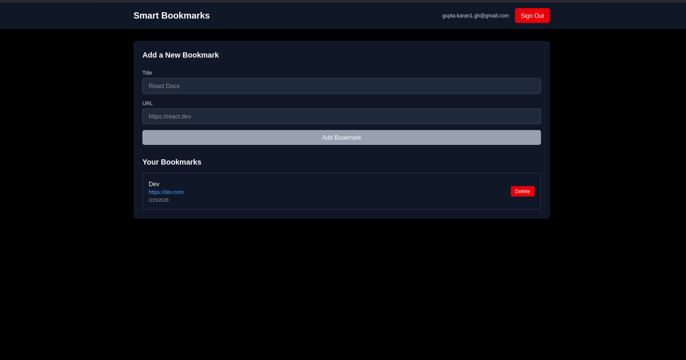

# Smart Bookmarks

A production-ready bookmark management application built with Next.js 15, Supabase (Auth + Postgres + Realtime), Tailwind CSS, and TypeScript. The project demonstrates server-side session handling, Row Level Security (RLS), optimistic UI updates, and realtime multi-tab synchronization.

---

## Tech Stack

* Next.js 15 (App Router)
* Supabase (Auth, PostgreSQL, Realtime)
* Tailwind CSS v4
* TypeScript
* Vercel Deployment

---

## Application Screenshot



---

## Demo Video

[Watch Demo Video](https://github.com/karangupta982/bookmark/issues/1#issue-3942605284)

---

## Installation

```bash
npm install
```

Create `.env.local`:

```env
NEXT_PUBLIC_SUPABASE_URL=your_url
NEXT_PUBLIC_SUPABASE_ANON_KEY=your_key
```

Run development server:

```bash
npm run dev
```

Visit:

[http://localhost:3000](http://localhost:3000)

---

## Database Setup

Run in Supabase SQL Editor:

```sql
CREATE TABLE bookmarks (
  id UUID PRIMARY KEY DEFAULT gen_random_uuid(),
  user_id UUID NOT NULL REFERENCES auth.users ON DELETE CASCADE,
  title TEXT NOT NULL,
  url TEXT NOT NULL,
  created_at TIMESTAMP WITH TIME ZONE DEFAULT NOW()
);

CREATE INDEX idx_bookmarks_user_id ON bookmarks(user_id);

ALTER TABLE bookmarks ENABLE ROW LEVEL SECURITY;

CREATE POLICY "SELECT" ON bookmarks
FOR SELECT USING (auth.uid() = user_id);

CREATE POLICY "INSERT" ON bookmarks
FOR INSERT WITH CHECK (auth.uid() = user_id);

CREATE POLICY "DELETE" ON bookmarks
FOR DELETE USING (auth.uid() = user_id);

CREATE POLICY "UPDATE" ON bookmarks
FOR UPDATE USING (auth.uid() = user_id)
WITH CHECK (auth.uid() = user_id);
```

Enable Realtime for the bookmarks table in Supabase Dashboard → Replication.

Test using two accounts to verify Row Level Security isolation.

---

# Problems that i ran into and how i solved them

## 1. OAuth Redirect Failing After Deployment

**Problem:**
Authentication worked locally but failed after deploying to Vercel. Google login redirected with an invalid redirect URI error.

**Cause:**
Production URLs were not properly registered in Supabase Auth settings and Google Cloud Console.

**Solution:**
Configured both localhost and production domains in:

* Supabase Site URL
* Supabase Redirect URLs
* Google Cloud Authorized Redirect URIs

Also updated OAuth configuration to dynamically use `window.location.origin`, making authentication environment-agnostic.

---

## 2. Session Desynchronization in Next.js App Router

**Problem:**
After login, refreshing the dashboard sometimes caused a flash of unauthenticated content or session loss.

**Cause:**
App Router requires proper server-side cookie handling. Client-side session checks alone were not sufficient.

**Solution:**
Implemented middleware using `@supabase/ssr` to validate and refresh sessions at the edge before rendering protected routes. This ensured consistent session persistence and eliminated UI flicker.

---

## 3. Manual Refetching vs. Proper State Synchronization

**Problem:**
Initially, after adding a bookmark, the app performed a second API call to refetch the entire list. This introduced latency and unnecessary network overhead.

**Solution:**
Adopted a state-lifting pattern where the `DashboardPage` maintains the bookmarks array as the single source of truth. The `BookmarkForm` passes the newly created record back to the parent component, enabling an optimistic UI update without redundant network requests.

---

## 4. TypeScript Prop Mismatch (ts2322 Error)

**Problem:**
The `BookmarkList` component produced a `ts(2322)` error stating that props were not assignable to `IntrinsicAttributes`.

**Cause:**
Props were being passed without a properly defined TypeScript interface.

**Solution:**
Created a dedicated `BookmarkListProps` interface and explicitly typed the component:

```ts
interface BookmarkListProps {
  bookmarks: Bookmark[];
  onDelete: (id: string) => void;
  user: User;
}

export default function BookmarkList({
  bookmarks,
  onDelete,
  user,
}: BookmarkListProps) { ... }
```

This resolved the compiler error and improved type safety across the dashboard.

---

## 5. RLS Insert Failing Silently

**Problem:**
Bookmark inserts failed without obvious frontend errors.

**Cause:**
The RLS policy included `USING` but did not include `WITH CHECK`, which is required for INSERT validation.

**Solution:**
Updated policies to correctly separate:

* `USING (user_id = auth.uid())` for SELECT and DELETE
* `WITH CHECK (user_id = auth.uid())` for INSERT

Tested with multiple accounts to verify isolation.

---

## 6. Multi-Tab Data Desynchronization

**Problem:**
If the app was open in two browser tabs, adding a bookmark in one tab did not appear in the other until manual refresh.

**Cause:**
Realtime was not enabled or configured for the bookmarks table.

**Solution:**
Enabled the table in Supabase Realtime Publications and added a `useEffect` subscription in the dashboard to listen for `postgres_changes` events. This allowed updates to propagate instantly across tabs.

---

## 7. Realtime Broadcasting to All Users

**Problem:**
Initial realtime subscription received updates for all users instead of just the logged-in user.

**Cause:**
Missing filter condition in the realtime channel configuration.

**Solution:**
Scoped the subscription with:

```
filter: `user_id=eq.${user.id}`
```

This ensured only relevant row updates were broadcast to the current client.

---

## 8. Duplicate Item Race Condition (Optimistic UI + Realtime)

**Problem:**
With both optimistic UI and realtime active, the tab that created the bookmark could show it twice:

* Once from local optimistic update
* Once from realtime broadcast

**Solution:**
Implemented a deduplication check inside the state setter:

```ts
setBookmarks((prev) => {
  if (prev.find((b) => b.id === payload.new.id)) return prev;
  return [payload.new, ...prev];
});
```

This prevents duplicate entries while maintaining realtime synchronization.

---

## 9. UUID Function Error in Supabase

**Problem:**
Using `uuid_generate_v4()` caused a database error during table creation.

**Cause:**
The `uuid-ossp` extension was not enabled.

**Solution:**
Replaced it with `gen_random_uuid()`, which is supported by default in Supabase.

---

## 10. Middleware Over-Protecting Routes

**Problem:**
Initial middleware configuration blocked public routes and static assets.

**Cause:**
Middleware matcher was too broad.

**Solution:**
Scoped middleware to protect only dashboard routes:

```ts
export const config = {
  matcher: ['/dashboard/:path*'],
};
```

This preserved access to public pages while protecting authenticated routes.

---

## 11. Node.js Environment Compatibility

**Problem:**
Build errors and dependency conflicts occurred when using Next.js 15+ and Tailwind CSS v4. Certain features were not fully supported in the existing Node.js 18 environment.

**Cause:**
The local development runtime was outdated relative to the framework requirements. Next.js 15 and newer ecosystem tooling rely on features available only in newer Node.js LTS versions.

**Solution:**
Identified the runtime mismatch and upgraded the local environment using NVM (Node Version Manager) to Node.js 22 (LTS). This resolved dependency conflicts, stabilized builds, and enabled Turbopack for faster development compilation.


